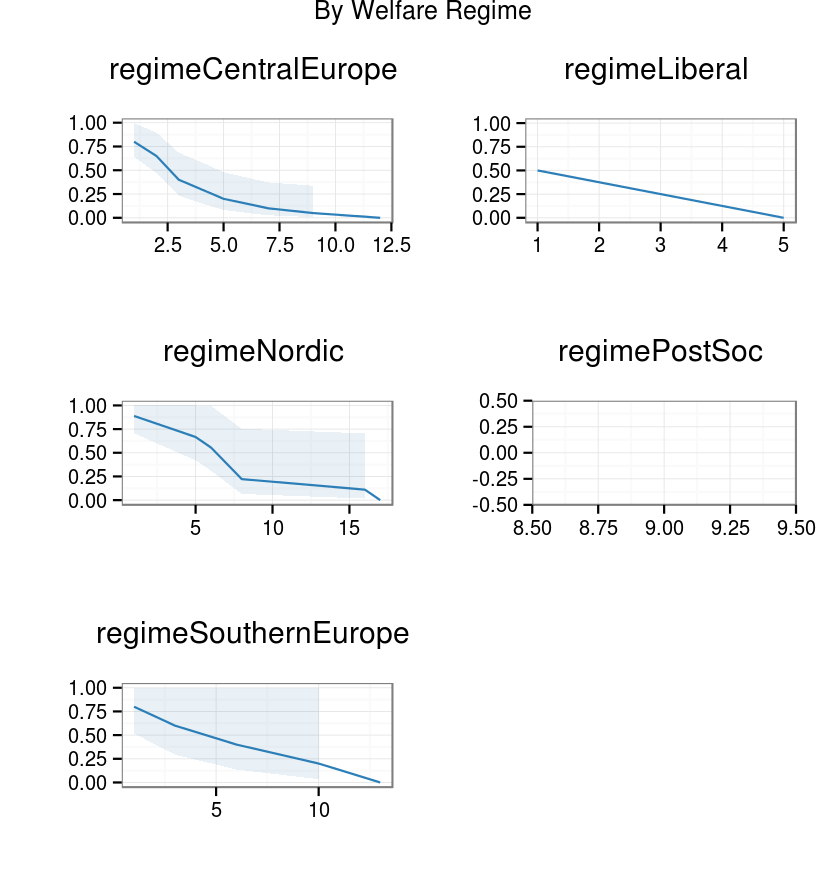
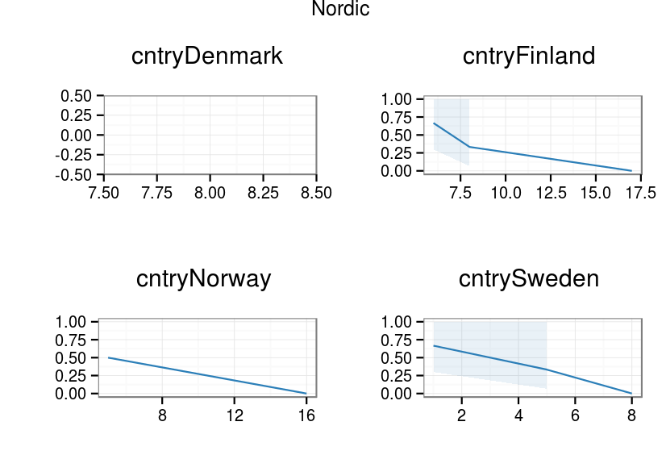

- [Back to index](index.html)

# Survival curves of mothers returning work


```{roptsmissing, echo=FALSE}
opts_chunk$set(echo=FALSE,eval=TRUE,fig.height=8, fig.width=10,cache=TRUE)
```

```{rsurvivalloaddata}
load("data/datEnterBirth3.RData")
```

## Variable: PL210x - Main activity by month

The key variale [PL210A - Main activity on January](http://www.gesis.org/?id=8063#PL210A) has following values

Table: Values and labels of var PL210A - Main activity on January

| Value | Label |
| ----- | ----- |
| 1 | Employee (full-time) |
| 2 | Employee (part-time) |
| 3 | Self-employed (full-time) |
| 4 | Self-employed (part-time) |
| 5 | unemployed |
| 6 | Retired |
| 7 | Student |
| 8 | Other inactive |

Below are plotted all the values as stacked bars from all the months of the data

### All the European mothers

```{rsurvivalplotvalues, fig.height=14}
library(reshape2)
varlist <- c("PER_ID","RB010","RB020","PL210A","PL210B",
             "PL210C","PL210D",
             "PL210E","PL210F",
             "PL210G","PL210H",
             "PL210I","PL210J",
             "PL210K","PL210L")

dat2005 <- datEnterBirth3[datEnterBirth3$RB010 == 2005,varlist]
dat2005.l <- melt(dat2005, id.vars = c("RB010","RB020","PER_ID"))
# 1 2006
dat2006 <- datEnterBirth3[datEnterBirth3$RB010 == 2006,varlist]
dat2006.l <- melt(dat2006, id.vars = c("RB010","RB020","PER_ID"))
# 1 2007
dat2007 <- datEnterBirth3[datEnterBirth3$RB010 == 2007,varlist]
dat2007.l <- melt(dat2007, id.vars = c("RB010","RB020","PER_ID"))
# 1 2008
dat2008 <- datEnterBirth3[datEnterBirth3$RB010 == 2008,varlist]
dat2008.l <- melt(dat2008, id.vars = c("RB010","RB020","PER_ID"))
# 1 2009
dat2009 <- datEnterBirth3[datEnterBirth3$RB010 == 2009,varlist]
dat2009.l <- melt(dat2009, id.vars = c("RB010","RB020","PER_ID"))
# 2010
dat2010 <- datEnterBirth3[datEnterBirth3$RB010 == 2010,varlist]
dat2010.l <- melt(dat2010, id.vars = c("RB010","RB020","PER_ID"))
# 2011
dat2011 <- datEnterBirth3[datEnterBirth3$RB010 == 2011,varlist]
dat2011.l <- melt(dat2011, id.vars = c("RB010","RB020","PER_ID"))

dat <- rbind(#dat2005.l,
             #dat2006.l,
             dat2007.l,
             dat2008.l,
             dat2009.l,
             dat2010.l,
             dat2011.l)

dat$time[dat$variable == "PL210A"] <- "01-01"
dat$time[dat$variable == "PL210B"] <- "02-01"
dat$time[dat$variable == "PL210C"] <- "03-01"
dat$time[dat$variable == "PL210D"] <- "04-01"
dat$time[dat$variable == "PL210E"] <- "05-01"
dat$time[dat$variable == "PL210F"] <- "06-01"
dat$time[dat$variable == "PL210G"] <- "07-01"
dat$time[dat$variable == "PL210H"] <- "08-01"
dat$time[dat$variable == "PL210I"] <- "09-01"
dat$time[dat$variable == "PL210J"] <- "10-01"
dat$time[dat$variable == "PL210K"] <- "11-01"
dat$time[dat$variable == "PL210L"] <- "12-01"
dat$date <- paste(dat$RB010,dat$time,sep="-")
dat$date <- as.Date(dat$date)

dat$value[is.na(dat$value)] <- 0

library(ggplot2)
tbl <- as.data.frame(table(dat$date,dat$value))

tbl$value[tbl$Var2 == 1] <- "Employee (full-time)"
tbl$value[tbl$Var2 == 2] <- "Employee (part-time)"
tbl$value[tbl$Var2 == 3] <- "Self-employed (full-time)"
tbl$value[tbl$Var2 == 4] <- "Self-employed (part-time)"
tbl$value[tbl$Var2 == 5] <- "unemployed"
tbl$value[tbl$Var2 == 6] <- "Retired"
tbl$value[tbl$Var2 == 7] <- "Student"
tbl$value[tbl$Var2 == 8] <- "Other inactive"
tbl$value[tbl$Var2 == 0] <- "missing data"

tbl$value <- factor(tbl$value, levels=c("Employee (full-time)",
                                        "Employee (part-time)",
                                        "Self-employed (full-time)",
                                        "Self-employed (part-time)",
                                        "unemployed",
                                        "Retired",
                                        "Student",
                                        "Other inactive",
                                        "missing data"))

manual_fill <- scale_fill_manual(values=c("#999999", "#E69F00", 
                                          "#56B4E9", "#009E73",
                                          "#D55E00", "#CC79A7",
                                          "#0072B2","#F0E442",
                                          "#000000"))

ggplot(tbl, aes(x=Var1,y=Freq,fill=value)) +
         geom_bar(stat="identity") +
  coord_flip() + manual_fill +
  theme(legend.position="top") +
  guides(fill = guide_legend(nrow = 2))


```

### Mothers by country

```{rsurvivalplotvaluesbycountry, fig.height=32}
tbl <- as.data.frame(table(dat$RB020,dat$date,dat$value))


tbl$value[tbl$Var3 == 1] <- "Employee (full-time)"
tbl$value[tbl$Var3 == 2] <- "Employee (part-time)"
tbl$value[tbl$Var3 == 3] <- "Self-employed (full-time)"
tbl$value[tbl$Var3 == 4] <- "Self-employed (part-time)"
tbl$value[tbl$Var3 == 5] <- "unemployed"
tbl$value[tbl$Var3 == 6] <- "Retired"
tbl$value[tbl$Var3 == 7] <- "Student"
tbl$value[tbl$Var3 == 8] <- "Other inactive"
tbl$value[tbl$Var3 == 0] <- "missing data"

tbl$value <- factor(tbl$value, levels=c("Employee (full-time)",
                                        "Employee (part-time)",
                                        "Self-employed (full-time)",
                                        "Self-employed (part-time)",
                                        "unemployed",
                                        "Retired",
                                        "Student",
                                        "Other inactive",
                                        "missing data"))

ggplot(tbl, aes(x=Var2,y=Freq,fill=value)) +
         geom_bar(stat="identity") +
  coord_flip() + manual_fill +
  theme(legend.position="top") +
  facet_wrap(~Var1,ncol=4) +
  guides(fill = guide_legend(nrow = 2))


```

**Some notes**

- Data is perfect from some countries and useless in others
- From the latest years it is basically missing

Previously I subsetted certain countries (excluding nordic for instance), but now I have included all the countries AND all the years.

## creating a survival data.frame

[CRAN Task View: Survival Analysis](http://cran.r-project.org/web/views/Survival.html) works as a starting point.

> Survival analysis, also called event history analysis in social science, or reliability analysis in engineering, deals with time until occurrence of an event of interest. However, this failure time may not be observed within the relevant time period, producing so-called censored observations.

>This task view aims at presenting the useful R packages for the analysis of time to event data. 

### Filtering countries & years with missing data

And get this data.

```{rsurvivalfiltermissindata1}

#datS <- dat[dat$RB020 %in% clist,]
datS <- dat
#datS <- datS[datS$RB010 <= 2008,]

datS$RB020 <- factor(datS$RB020)

tbl <- as.data.frame(table(datS$RB020,datS$date,datS$value))

tbl$value[tbl$Var3 == 1] <- "Employee (full-time)"
tbl$value[tbl$Var3 == 2] <- "Employee (part-time)"
tbl$value[tbl$Var3 == 3] <- "Self-employed (full-time)"
tbl$value[tbl$Var3 == 4] <- "Self-employed (part-time)"
tbl$value[tbl$Var3 == 5] <- "unemployed"
tbl$value[tbl$Var3 == 6] <- "Retired"
tbl$value[tbl$Var3 == 7] <- "Student"
tbl$value[tbl$Var3 == 8] <- "Other inactive"
tbl$value[tbl$Var3 == 0] <- "missing data"

tbl$value <- factor(tbl$value, levels=c("Employee (full-time)",
                                        "Employee (part-time)",
                                        "Self-employed (full-time)",
                                        "Self-employed (part-time)",
                                        "unemployed",
                                        "Retired",
                                        "Student",
                                        "Other inactive",
                                        "missing data"))

ggplot(tbl, aes(x=Var2,y=Freq,fill=value)) +
         geom_bar(stat="identity") +
  coord_flip() + manual_fill +
  theme(legend.position="top") +
  facet_wrap(~Var1,ncol=4) +
  guides(fill = guide_legend(nrow = 2))


```

### Discrete time data

We assume that mothers on welfare benefits belong to group 8 (Other inactive) and therefore an event would change over to value 1:4 (employee/self-employed - full/part-time)


```{rsurvivaldatacreation1, eval=FALSE}
datS <- dat
# let's create an event variable
library(reshape2)
datS$vdate <- paste("v",datS$date,sep="_")

df.wide <- dcast(datS, PER_ID + RB020 ~ vdate, 
                 value.var = "value")

df.wide[is.na(df.wide)] <- 0

# start date - from missing data to any value
df.wide$start1[df.wide[,3] == 1:4 & df.wide[,4] == 8] <- 1
df.wide$start2[df.wide[,4] == 1:4 & df.wide[,5] == 8] <- 1
df.wide$start3[df.wide[,5] == 1:4 & df.wide[,6] == 8] <- 1
df.wide$start4[df.wide[,6] == 1:4 & df.wide[,7] == 8] <- 1
df.wide$start5[df.wide[,7] == 1:4 & df.wide[,8] == 8] <- 1
df.wide$start6[df.wide[,8] == 1:4 & df.wide[,9] == 8] <- 1
df.wide$start7[df.wide[,9] == 1:4 & df.wide[,10] == 8] <- 1
df.wide$start8[df.wide[,10] == 1:4 & df.wide[,11] == 8] <- 1
df.wide$start9[df.wide[,11] == 1:4 & df.wide[,12] == 8] <- 1
df.wide$start10[df.wide[,12] == 1:4 & df.wide[,13] == 8] <- 1
df.wide$start11[df.wide[,13] == 1:4 & df.wide[,14] == 8] <- 1
df.wide$start12[df.wide[,14] == 1:4 & df.wide[,15] == 8] <- 1
df.wide$start13[df.wide[,15] == 1:4 & df.wide[,16] == 8] <- 1
df.wide$start14[df.wide[,16] == 1:4 & df.wide[,17] == 8] <- 1
df.wide$start15[df.wide[,17] == 1:4 & df.wide[,18] == 8] <- 1
df.wide$start16[df.wide[,18] == 1:4 & df.wide[,19] == 8] <- 1
df.wide$start17[df.wide[,19] == 1:4 & df.wide[,20] == 8] <- 1
df.wide$start18[df.wide[,20] == 1:4 & df.wide[,21] == 8] <- 1
df.wide$start19[df.wide[,21] == 1:4 & df.wide[,22] == 8] <- 1
df.wide$start20[df.wide[,22] == 1:4 & df.wide[,23] == 8] <- 1
df.wide$start21[df.wide[,23] == 1:4 & df.wide[,24] == 8] <- 1
df.wide$start22[df.wide[,24] == 1:4 & df.wide[,25] == 8] <- 1
df.wide$start23[df.wide[,25] == 1:4 & df.wide[,26] == 8] <- 1
df.wide$start24[df.wide[,26] == 1:4 & df.wide[,27] == 8] <- 1
df.wide$start25[df.wide[,27] == 1:4 & df.wide[,28] == 8] <- 1
df.wide$start26[df.wide[,28] == 1:4 & df.wide[,29] == 8] <- 1
df.wide$start27[df.wide[,29] == 1:4 & df.wide[,30] == 8] <- 1
df.wide$start28[df.wide[,30] == 1:4 & df.wide[,31] == 8] <- 1
df.wide$start29[df.wide[,31] == 1:4 & df.wide[,32] == 8] <- 1
df.wide$start30[df.wide[,32] == 1:4 & df.wide[,33] == 8] <- 1
df.wide$start31[df.wide[,33] == 1:4 & df.wide[,34] == 8] <- 1
df.wide$start32[df.wide[,34] == 1:4 & df.wide[,35] == 8] <- 1
df.wide$start33[df.wide[,35] == 1:4 & df.wide[,36] == 8] <- 1
df.wide$start34[df.wide[,36] == 1:4 & df.wide[,37] == 8] <- 1
df.wide$start35[df.wide[,37] == 1:4 & df.wide[,38] == 8] <- 1
df.wide$start36[df.wide[,38] == 1:4 & df.wide[,39] == 8] <- 1
df.wide$start37[df.wide[,39] == 1:4 & df.wide[,40] == 8] <- 1
df.wide$start38[df.wide[,40] == 1:4 & df.wide[,41] == 8] <- 1
df.wide$start39[df.wide[,41] == 1:4 & df.wide[,42] == 8] <- 1
df.wide$start40[df.wide[,42] == 1:4 & df.wide[,43] == 8] <- 1
df.wide$start41[df.wide[,43] == 1:4 & df.wide[,44] == 8] <- 1
df.wide$start42[df.wide[,44] == 1:4 & df.wide[,45] == 8] <- 1
df.wide$start43[df.wide[,45] == 1:4 & df.wide[,46] == 8] <- 1
df.wide$start44[df.wide[,46] == 1:4 & df.wide[,47] == 8] <- 1
df.wide$start45[df.wide[,47] == 1:4 & df.wide[,48] == 8] <- 1
df.wide$start46[df.wide[,48] == 1:4 & df.wide[,49] == 8] <- 1
df.wide$start47[df.wide[,49] == 1:4 & df.wide[,50] == 8] <- 1
df.wide$start48[df.wide[,50] == 1:4 & df.wide[,51] == 8] <- 1
df.wide$start49[df.wide[,51] == 1:4 & df.wide[,52] == 8] <- 1
df.wide$start50[df.wide[,52] == 1:4 & df.wide[,53] == 8] <- 1
df.wide$start51[df.wide[,53] == 1:4 & df.wide[,54] == 8] <- 1
df.wide$start52[df.wide[,54] == 1:4 & df.wide[,55] == 8] <- 1
df.wide$start53[df.wide[,55] == 1:4 & df.wide[,56] == 8] <- 1
df.wide$start54[df.wide[,56] == 1:4 & df.wide[,57] == 8] <- 1
df.wide$start55[df.wide[,57] == 1:4 & df.wide[,58] == 8] <- 1
df.wide$start56[df.wide[,58] == 1:4 & df.wide[,59] == 8] <- 1
df.wide$start57[df.wide[,59] == 1:4 & df.wide[,60] == 8] <- 1
df.wide$start58[df.wide[,60] == 1:4 & df.wide[,61] == 8] <- 1
df.wide$start59[df.wide[,61] == 1:4 & df.wide[,62] == 8] <- 1
df.wide$start60[df.wide[,62] == 1:4 & df.wide[,63] == 8] <- 1
df.wide$start61[df.wide[,63] == 1:4 & df.wide[,64] == 8] <- 1
df.wide$start62[df.wide[,64] == 1:4 & df.wide[,65] == 8] <- 1
df.wide$start63[df.wide[,65] == 1:4 & df.wide[,66] == 8] <- 1
df.wide$start64[df.wide[,66] == 1:4 & df.wide[,67] == 8] <- 1
df.wide$start65[df.wide[,67] == 1:4 & df.wide[,68] == 8] <- 1
df.wide$start66[df.wide[,68] == 1:4 & df.wide[,69] == 8] <- 1
df.wide$start67[df.wide[,69] == 1:4 & df.wide[,70] == 8] <- 1
df.wide$start68[df.wide[,70] == 1:4 & df.wide[,71] == 8] <- 1
df.wide$start69[df.wide[,71] == 1:4 & df.wide[,72] == 8] <- 1
df.wide$start70[df.wide[,72] == 1:4 & df.wide[,73] == 8] <- 1
df.wide$start71[df.wide[,73] == 1:4 & df.wide[,74] == 8] <- 1
df.wide$start72[df.wide[,74] == 1:4 & df.wide[,75] == 8] <- 1
df.wide$start73[df.wide[,75] == 1:4 & df.wide[,76] == 8] <- 1
df.wide$start74[df.wide[,76] == 1:4 & df.wide[,77] == 8] <- 1
df.wide$start75[df.wide[,77] == 1:4 & df.wide[,78] == 8] <- 1
df.wide$start76[df.wide[,78] == 1:4 & df.wide[,79] == 8] <- 1
df.wide$start77[df.wide[,79] == 1:4 & df.wide[,80] == 8] <- 1
df.wide$start78[df.wide[,80] == 1:4 & df.wide[,81] == 8] <- 1
df.wide$start79[df.wide[,81] == 1:4 & df.wide[,82] == 8] <- 1
df.wide$start80[df.wide[,82] == 1:4 & df.wide[,83] == 8] <- 1
df.wide$start81[df.wide[,83] == 1:4 & df.wide[,84] == 8] <- 1
df.wide$start82[df.wide[,84] == 1:4 & df.wide[,85] == 8] <- 1
df.wide$start83[df.wide[,85] == 1:4 & df.wide[,86] == 8] <- 1


# end date
df.wide$end1[df.wide[,3] == 8 & df.wide[,4] %in% 1:4] <- 1
df.wide$end2[df.wide[,4] == 8 & df.wide[,5] %in% 1:4] <- 1
df.wide$end3[df.wide[,5] == 8 & df.wide[,6] %in% 1:4] <- 1
df.wide$end4[df.wide[,6] == 8 & df.wide[,7] %in% 1:4] <- 1
df.wide$end5[df.wide[,7] == 8 & df.wide[,8] %in% 1:4] <- 1
df.wide$end6[df.wide[,8] == 8 & df.wide[,9] %in% 1:4] <- 1
df.wide$end7[df.wide[,9] == 8 & df.wide[,10] %in% 1:4] <- 1
df.wide$end8[df.wide[,10] == 8 & df.wide[,11] %in% 1:4] <- 1
df.wide$end9[df.wide[,11] == 8 & df.wide[,12] %in% 1:4] <- 1
df.wide$end10[df.wide[,12] == 8 & df.wide[,13] %in% 1:4] <- 1
df.wide$end11[df.wide[,13] == 8 & df.wide[,14] %in% 1:4] <- 1
df.wide$end12[df.wide[,14] == 8 & df.wide[,15] %in% 1:4] <- 1
df.wide$end13[df.wide[,15] == 8 & df.wide[,16] %in% 1:4] <- 1
df.wide$end14[df.wide[,16] == 8 & df.wide[,17] %in% 1:4] <- 1
df.wide$end15[df.wide[,17] == 8 & df.wide[,18] %in% 1:4] <- 1
df.wide$end16[df.wide[,18] == 8 & df.wide[,19] %in% 1:4] <- 1
df.wide$end17[df.wide[,19] == 8 & df.wide[,20] %in% 1:4] <- 1
df.wide$end18[df.wide[,20] == 8 & df.wide[,21] %in% 1:4] <- 1
df.wide$end19[df.wide[,21] == 8 & df.wide[,22] %in% 1:4] <- 1
df.wide$end20[df.wide[,22] == 8 & df.wide[,23] %in% 1:4] <- 1
df.wide$end21[df.wide[,23] == 8 & df.wide[,24] %in% 1:4] <- 1
df.wide$end22[df.wide[,24] == 8 & df.wide[,25] %in% 1:4] <- 1
df.wide$end23[df.wide[,25] == 8 & df.wide[,26] %in% 1:4] <- 1
df.wide$end24[df.wide[,26] == 8 & df.wide[,27] %in% 1:4] <- 1
df.wide$end25[df.wide[,27] == 8 & df.wide[,28] %in% 1:4] <- 1
df.wide$end26[df.wide[,28] == 8 & df.wide[,29] %in% 1:4] <- 1
df.wide$end27[df.wide[,29] == 8 & df.wide[,30] %in% 1:4] <- 1
df.wide$end28[df.wide[,30] == 8 & df.wide[,31] %in% 1:4] <- 1
df.wide$end29[df.wide[,31] == 8 & df.wide[,32] %in% 1:4] <- 1
df.wide$end30[df.wide[,32] == 8 & df.wide[,33] %in% 1:4] <- 1
df.wide$end31[df.wide[,33] == 8 & df.wide[,34] %in% 1:4] <- 1
df.wide$end32[df.wide[,34] == 8 & df.wide[,35] %in% 1:4] <- 1
df.wide$end33[df.wide[,35] == 8 & df.wide[,36] %in% 1:4] <- 1
df.wide$end34[df.wide[,36] == 8 & df.wide[,37] %in% 1:4] <- 1
df.wide$end35[df.wide[,37] == 8 & df.wide[,38] %in% 1:4] <- 1
df.wide$end36[df.wide[,38] == 8 & df.wide[,39] %in% 1:4] <- 1
df.wide$end37[df.wide[,39] == 8 & df.wide[,40] %in% 1:4] <- 1
df.wide$end38[df.wide[,40] == 8 & df.wide[,41] %in% 1:4] <- 1
df.wide$end39[df.wide[,41] == 8 & df.wide[,42] %in% 1:4] <- 1
df.wide$end40[df.wide[,42] == 8 & df.wide[,43] %in% 1:4] <- 1
df.wide$end41[df.wide[,43] == 8 & df.wide[,44] %in% 1:4] <- 1
df.wide$end42[df.wide[,44] == 8 & df.wide[,45] %in% 1:4] <- 1
df.wide$end43[df.wide[,45] == 8 & df.wide[,46] %in% 1:4] <- 1
df.wide$end44[df.wide[,46] == 8 & df.wide[,47] %in% 1:4] <- 1
df.wide$end45[df.wide[,47] == 8 & df.wide[,48] %in% 1:4] <- 1
df.wide$end46[df.wide[,48] == 8 & df.wide[,49] %in% 1:4] <- 1
df.wide$end47[df.wide[,49] == 8 & df.wide[,50] %in% 1:4] <- 1
df.wide$end48[df.wide[,50] == 8 & df.wide[,51] %in% 1:4] <- 1
df.wide$end49[df.wide[,51] == 8 & df.wide[,52] %in% 1:4] <- 1
df.wide$end50[df.wide[,52] == 8 & df.wide[,53] %in% 1:4] <- 1
df.wide$end51[df.wide[,53] == 8 & df.wide[,54] %in% 1:4] <- 1
df.wide$end52[df.wide[,54] == 8 & df.wide[,55] %in% 1:4] <- 1
df.wide$end53[df.wide[,55] == 8 & df.wide[,56] %in% 1:4] <- 1
df.wide$end54[df.wide[,56] == 8 & df.wide[,57] %in% 1:4] <- 1
df.wide$end55[df.wide[,57] == 8 & df.wide[,58] %in% 1:4] <- 1
df.wide$end56[df.wide[,58] == 8 & df.wide[,59] %in% 1:4] <- 1
df.wide$end57[df.wide[,59] == 8 & df.wide[,60] %in% 1:4] <- 1
df.wide$end58[df.wide[,60] == 8 & df.wide[,61] %in% 1:4] <- 1
df.wide$end59[df.wide[,61] == 8 & df.wide[,62] %in% 1:4] <- 1
df.wide$end60[df.wide[,62] == 8 & df.wide[,63] %in% 1:4] <- 1
df.wide$end61[df.wide[,63] == 8 & df.wide[,64] %in% 1:4] <- 1
df.wide$end62[df.wide[,64] == 8 & df.wide[,65] %in% 1:4] <- 1
df.wide$end63[df.wide[,65] == 8 & df.wide[,66] %in% 1:4] <- 1
df.wide$end64[df.wide[,66] == 8 & df.wide[,67] %in% 1:4] <- 1
df.wide$end65[df.wide[,67] == 8 & df.wide[,68] %in% 1:4] <- 1
df.wide$end66[df.wide[,68] == 8 & df.wide[,69] %in% 1:4] <- 1
df.wide$end67[df.wide[,69] == 8 & df.wide[,70] %in% 1:4] <- 1
df.wide$end68[df.wide[,70] == 8 & df.wide[,71] %in% 1:4] <- 1
df.wide$end69[df.wide[,71] == 8 & df.wide[,72] %in% 1:4] <- 1
df.wide$end70[df.wide[,72] == 8 & df.wide[,73] %in% 1:4] <- 1
df.wide$end71[df.wide[,73] == 8 & df.wide[,74] %in% 1:4] <- 1
df.wide$end72[df.wide[,74] == 8 & df.wide[,75] %in% 1:4] <- 1
df.wide$end73[df.wide[,75] == 8 & df.wide[,76] %in% 1:4] <- 1
df.wide$end74[df.wide[,76] == 8 & df.wide[,77] %in% 1:4] <- 1
df.wide$end75[df.wide[,77] == 8 & df.wide[,78] %in% 1:4] <- 1
df.wide$end76[df.wide[,78] == 8 & df.wide[,79] %in% 1:4] <- 1
df.wide$end77[df.wide[,79] == 8 & df.wide[,80] %in% 1:4] <- 1
df.wide$end78[df.wide[,80] == 8 & df.wide[,81] %in% 1:4] <- 1
df.wide$end79[df.wide[,81] == 8 & df.wide[,82] %in% 1:4] <- 1
df.wide$end80[df.wide[,82] == 8 & df.wide[,83] %in% 1:4] <- 1
df.wide$end81[df.wide[,83] == 8 & df.wide[,84] %in% 1:4] <- 1
df.wide$end82[df.wide[,84] == 8 & df.wide[,85] %in% 1:4] <- 1
df.wide$end83[df.wide[,85] == 8 & df.wide[,86] %in% 1:4] <- 1


df.long1 <- melt(df.wide, id.vars =c("PER_ID","RB020"), 
                measure.vars=c("start1","start2","start3","start4","start5","start6","start7","start8","start9","start10","start11","start12","start13","start14","start15","start16","start17","start18","start19","start20","start21","start22","start23","start24","start25","start26","start27","start28","start29","start30","start31","start32","start33","start34","start35","start36","start37","start38","start39","start40","start41","start42","start43","start44","start45","start46","start47","start48","start49","start50","start51","start52","start53","start54","start55","start56","start57","start58","start59","start60","start61","start62","start63","start64","start65","start66","start67","start68","start69","start70","start71","start72","start73","start74","start75","start76","start77","start78","start79","start80","start81","start82","start83"))

names(df.long1) <- c("PER_ID","RB020","var_start","value_start")

df.long1 <- df.long1[!is.na(df.long1$value), ]

df.long2 <- melt(df.wide, id.vars =c("PER_ID","RB020"), 
                measure.vars=c("end1","end2","end3","end4","end5","end6","end7","end8","end9","end10","end11","end12","end13","end14","end15","end16","end17","end18","end19","end20","end21","end22","end23","end24","end25","end26","end27","end28","end29","end30","end31","end32","end33","end34","end35","end36","end37","end38","end39","end40","end41","end42","end43","end44","end45","end46","end47","end48","end49","end50","end51","end52","end53","end54","end55","end56","end57","end58","end59","end60","end61","end62","end63","end64","end65","end66","end67","end68","end69","end70","end71","end72","end73","end74","end75","end76","end77","end78","end79","end80","end81","end82","end83"))

names(df.long2) <- c("PER_ID","cntry","var_end","value_end")

df.long2 <- df.long2[!is.na(df.long2$value), ]

df.long3 <- merge(df.long1,df.long2,by="PER_ID",all.x=TRUE)

df.long4 <- merge(df.long3,datS[,c("PER_ID","RB010","date")], by="PER_ID",all.x=TRUE)

library(stringr)
library(zoo)
df.long4$startDate <- as.Date(12753 + 
                                (as.numeric(str_replace(df.long4$var_start, 
                                                        "start","")))*31)
df.long4$endDate <- as.Date(12753 + 
                              (as.numeric(str_replace(df.long4$var_end,
                                                      "end", "")))*31)

df.na <- df.long4[is.na(df.long4$endDate),]
library(plyr)
maxDate <- ddply(df.na,~PER_ID,
            summarise,
            max=max(date))

df.long4 <- merge(df.long4,maxDate,by="PER_ID",all.x=TRUE)
df.long4$endDate2 <- ifelse(is.na(df.long4$endDate),df.long4$max,df.long4$endDate)
df.long4$endDate2 <- as.Date(df.long4$endDate2)

df.long4$duration <- as.numeric(df.long4$endDate2 - 
                                  df.long4$startDate)/31

#df.long3 <- df.long3[df.long3$duration > 0,]

df.long4$duration[df.long4$duration <= 0] <- NA

df.long4$event[df.long4$value_end == 1] <- TRUE
df.long4$event[is.na(df.long4$value_end)] <- FALSE

df.long4$dup <- duplicated(df.long4$PER_ID)
df.long4 <- df.long4[df.long4$dup == FALSE,]

save(df.long4, file="data/df.long4.RData")
```

### Length of maternity leave spells

```{rsurvivalplotlegntspells1, eval=FALSE}
ggplot(df.long3,
       aes(x=duration)) +
  geom_bar() +
  labs(title="Duration of maternity leave spells",
       x="duration in months")

```

```{rsurvivalplotlegntspells2, fig.height=16, eval=FALSE}
ggplot(df.long3,
       aes(x=duration)) +
  geom_bar() +
  labs(title="Duration of maternity leave spells by country",
       x="duration in months") +
  facet_wrap(~RB020, ncol=2)

```


```{rSurvivalcurves, results='hide'}
library(survival)
load("data/df.long4.RData")
load("data/cntryDat.RData")
#kmsurvival <- survfit(Surv(df.long3$duration,df.long3$event) ~ 1)
df.long4$cntry <- NULL
df.long4 <- merge(df.long4,cntryDat,by.x="RB020",
                   by.y="iso2c")


```

# Survival tables & curves 

## Mean duration between exiting work to entering work (maternal leave)

```{rsurMeanTime}
with(df.long4, tapply(duration[event == TRUE], regime[event ==TRUE], mean, na.rm=TRUE))
```

## Survival curves by regimes

First the tables

```{rsurvTablesRegime1}
reg <- survfit(Surv(df.long4$duration,df.long4$event) ~ df.long4$regime)
summary(reg)

```

And the preliminary plot

```{rsurvTablesRegime2}
# plot(reg, col=c(1:5), xlab="time", ylab="survival probability")
# legend(50,0.5, c("Central Europe","Liberal","Nordic","Post Soc","Southern Europe"),
#        col=(1:5),lwd=0.5)
source("survival/ggsurvMod.R")
plot <- ggsurv(reg)

ggsave(plot,file="figure/KaplanMeier.png",
       width=14/2.54, 
       height=10/2.54, 
       dpi=300)

```


[Load for Ms Word](figure/KaplanMeier.png)


<!--
Survival curves for the paper

**Number of mothers on maternity leave by events by country**

The table below lists numbers of mothers on maternity leave in each country (`sum` column) that. Column `notHappened` has number of mother that did not exit into work, but were sencored before event took place. `happened` column has the crucial number, that is the number of mother that exited to employment.
-->

```{rsurvivalTable1, results='asis', eval=FALSE}
load("data/cntryDat.RData")


tbl <- data.frame(table(df.long4$regime,df.long4$event))
tblW <- dcast(tbl, Var1 ~ Var2, value.var = "Freq")
tblW$sum <- rowSums(tblW[,2:3])
names(tblW) <- c("cntry","notHappened","happened","sum")
#kmsurvival <- survfit(Surv(df.long3$duration,df.long3$event) ~ 1)
library(xtable)
print.xtable(xtable(tblW), type="html")

```


```{rSurvRegiime, results='hide', eval=FALSE}


[For Word](figure/kmSurvRegime.png)

kmSurvRegime <- survfit(Surv(duration,event) ~ regime, 
                       data = df.long3)
kmSurvRegime <- survfit(Surv(time=as.numeric(df.long3$startDate),
                             time2=as.numeric(df.long3$endDate),
                             event=df.long3$event,
                             type="interval") ~ regime, 
                       data = df.long3)

so <- survfit(Surv(duration,event) ~ regime, 
                       data = df.long3)
plot(so)
library(eha)

plot.Surv(so)


data(lung)
lung.surv <- survfit(Surv(time,status) ~ 1, data = lung)
ggsurv(kmSurvRegime)

ppi <- 150
png("figure/kmSurvRegime.png", width=14/2.54*ppi, height=15/2.54*ppi, res=ppi)
ggfitStrata(kmSurvRegime, byStrata = TRUE, title="By Welfare Regime")
dev.off()

```


```{rSurvNord, results='hide', eval=FALSE}
## By regime and country

### Nordic



[for Word](figure/kmSurvNord.png)

library(simPH)
kmSurvNord <- survfit(Surv(duration,event) ~ cntry, 
                       data = df.long3[df.long3$regime == "Nordic",])

ggsurv(kmSurvNord)
ppi <- 150
png("figure/kmSurvNord.png", width=14/2.54*ppi, height=10/2.54*ppi, res=ppi)
ggfitStrata(kmSurvNord, byStrata = TRUE, 
            title="Nordic")
dev.off()


```


```{rSurvLibe, results='hide', eval=FALSE}
### Liberal


[for Word](figure/kmSurvLibe.png)

kmSurvLibe <- survfit(Surv(duration,event) ~ cntry, 
                       data = df.long3[df.long3$regime == "Liberal",])
ppi <- 150
png("figure/kmSurvLibe.png", width=14/2.54*ppi, height=10/2.54*ppi, res=ppi)
ggfitStrata(kmSurvLibe, byStrata = FALSE, 
            title="Liberal")
dev.off()
```


```{rSurvCeEu, results='hide', eval=FALSE}
### Central Europe


[For Word](figure/kmSurvCeEu.png)

kmSurvCeEu <- survfit(Surv(duration,event) ~ cntry, 
                       data = df.long3[df.long3$regime == "Central Europe",])
ppi <- 150
png("figure/kmSurvCeEu.png", width=14/2.54*ppi, height=10/2.54*ppi, res=ppi)
ggfitStrata(kmSurvCeEu, byStrata = TRUE, 
            title="Central Europe")
dev.off()
```


```{rSurvPoSo, results='hide', eval=FALSE}
### Post Socialist


[For Word](figure/kmSurvPoso.png)

kmSurvPoso <- survfit(Surv(duration,event) ~ cntry, 
                       data = df.long3[df.long3$regime == "Post Soc",])
ppi <- 150
png("figure/kmSurvPoso.png", width=14/2.54*ppi, height=15/2.54*ppi, res=ppi)
ggfitStrata(kmSurvPoso, byStrata = TRUE, 
            title="Post Soc")
dev.off()
```


```{rSurvSoEu, results='hide', eval=FALSE}
### Southern Europe


[For Word](figure/kmSurvSoEu.png)


kmSurvSoEu <- survfit(Surv(duration,event) ~ cntry, 
                       data = df.long3[df.long3$regime == "Southern Europe",])
ppi <- 150
png("figure/kmSurvSoEu.png", width=14/2.54*ppi, height=15/2.54*ppi, res=ppi)
ggfitStrata(kmSurvSoEu, byStrata = TRUE, 
            title="Southern Europe")
dev.off()
```


*****


```{r, eval=FALSE}
# revaueling the survfit objects strata values
# library(plyr)
# revalue(kmsurvival2$strata, 
#         replace = c(cntry=Austria = "Austria",
#                     cntry=Belgium = "Belgium",
#                     cntry=Czech Republic = "Czech Republic",
#                     cntry=Denmark = "Denmark",
#                     cntry=Estonia = "Estonia",
#                     cntry=Finland = "Finland",
#                     cntry=France = "France",
#                     cntry=Hungary = "Hungary",
#                     cntry=Ireland = "Ireland",
#                     cntry=Italy = "Italy",
#                     cntry=Netherlands = "Netherlands",
#                     cntry=Norway = "Norway",
#                     cntry=Poland = "Poland",
#                     cntry=Portugal = "Portugal",
#                     cntry=Slovakia = "Slovakia",
#                     cntry=Slovenia = "Slovenia",
#                     cntry=Spain = "Spain",
#                     cntry=Sweden = "Sweden"), 
#         warn_missing = TRUE)

```


```{rmiscsurvivalcode, eval=FALSE}
Load survival
library(survival)
Subset data
bladder1 <- bladder[bladder$enum < 5, ]
M1 <- coxph(Surv(stop, event) ~ (rx + size + number) * strata(enum) + cluster(id), bladder1)
M1Fit <- survfit(kmsurvival2)


df.long3$RB020num <- as.numeric(df.long3$RB020)
summary(df.long3$RB020num)


ggsurv(kmsurvival2)
summary(kmsurvival2)

lung.surv <- survfit(Surv(time,status) ~ 1, data = lung)
ggsurv(lung.surv)
lung.surv2 <- survfit(Surv(time,status) ~ sex, data = lung)
(pl2 <- ggsurv(lung.surv2))

plot(kmsurvival, xlab="Time", ylab="Survival Probability")

# Kaplan-Meier non-parametric analysis by group
kmsurvival1 <- survfit(Surv(df.long3$duration,df.long3$event) ~ df.long3$RB020)
ggsurv(kmsurvival1)
plot(kmsurvival1, xlab="Time", ylab="Survival Probability")

# Nelson-Aalen non-parametric analysis
nasurvival <- survfit(coxph(Surv(df.long3$duration,df.long3$event) ~ 1), type="aalen")
summary(nasurvival)
plot(nasurvival, xlab="Time", ylab="Survival Probability")


# Cox proportional hazard model - coefficients and hazard rates
#coxph <- coxph(Surv(df.long3$duration,df.long3$event) ~ X, method="breslow")
#coxph <- coxph(Surv(time,event) ~ X, method="breslow")
#summary(coxph)


# Exponential, Weibull, and log-logistic parametric model coefficients
# Opposite signs from Stata results, Weibull results differ; same as SAS
#exponential <- survreg(Surv(df.long3$duration,df.long3$event) ~ X, dist="exponential")
#exponential <- survreg(Surv(time,event) ~ X, dist="exponential")
#summary(exponential)

#weibull <- survreg(Surv(time,event) ~ X, dist="weibull")
#summary(weibull)

loglogistic <- survreg(Surv(time,event) ~ X, dist="loglogistic")
summary(loglogistic)


s <- coxph(Surv(df.long3$duration, df.long3$event), ~RB020, data = df.long3)
    type="right",
    origin=0))
is.Surv(s)
```

