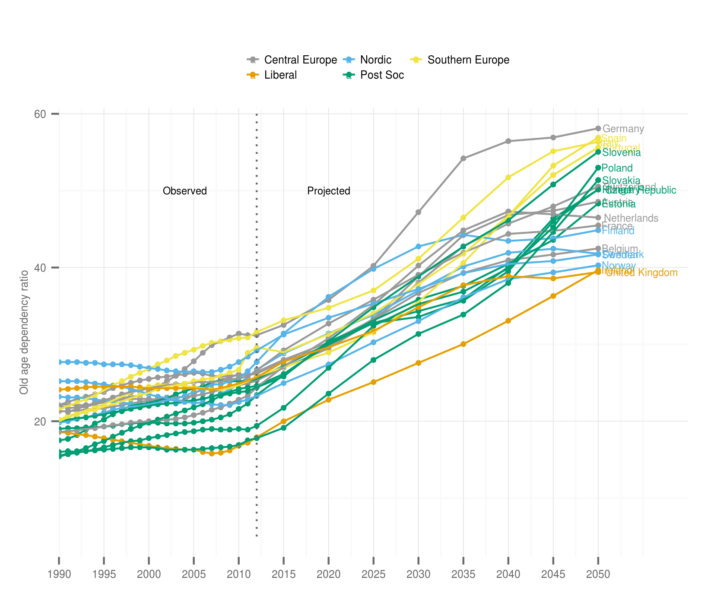
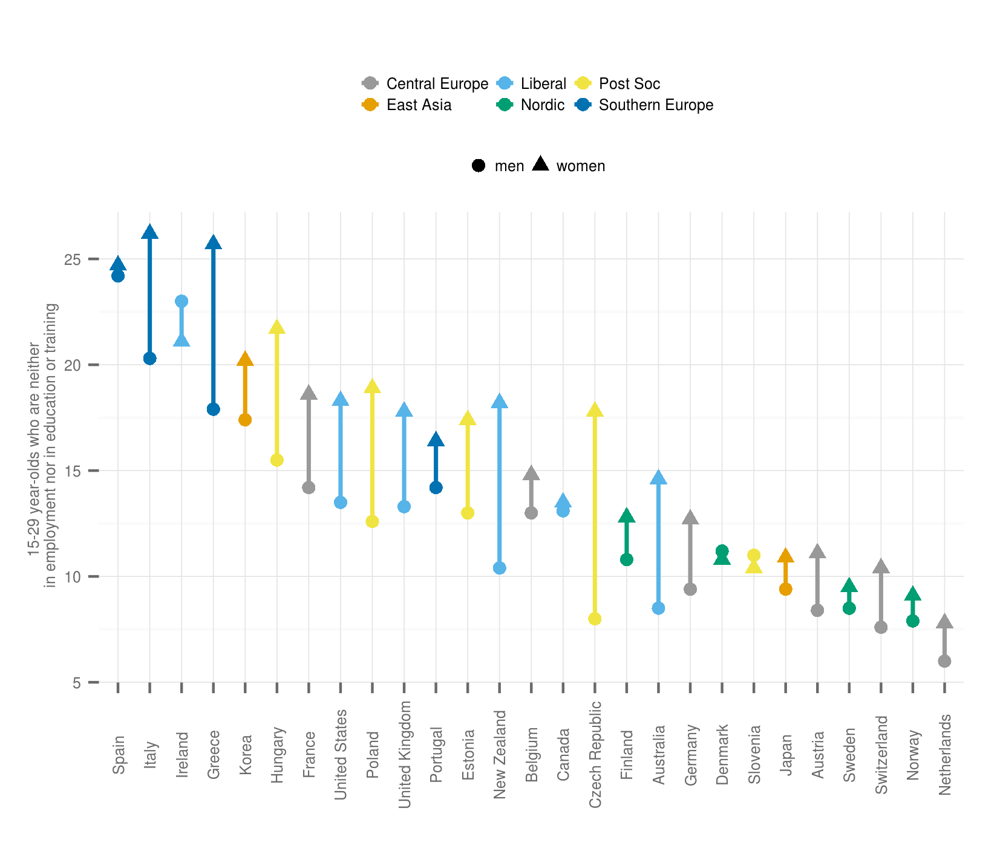
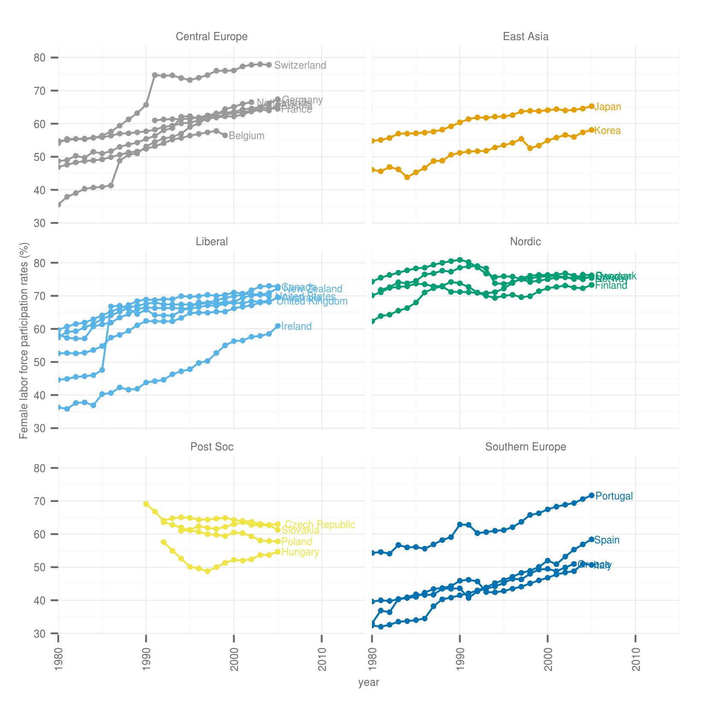
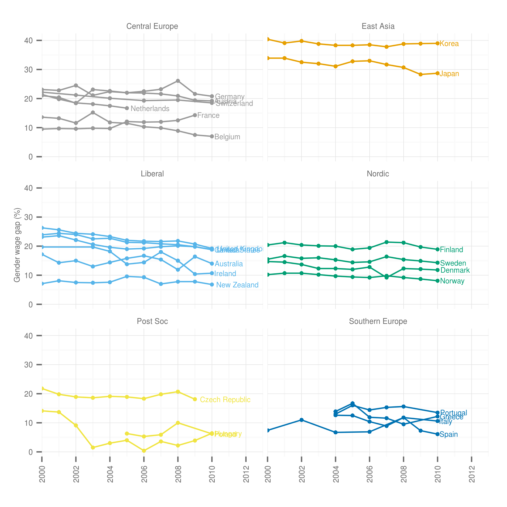
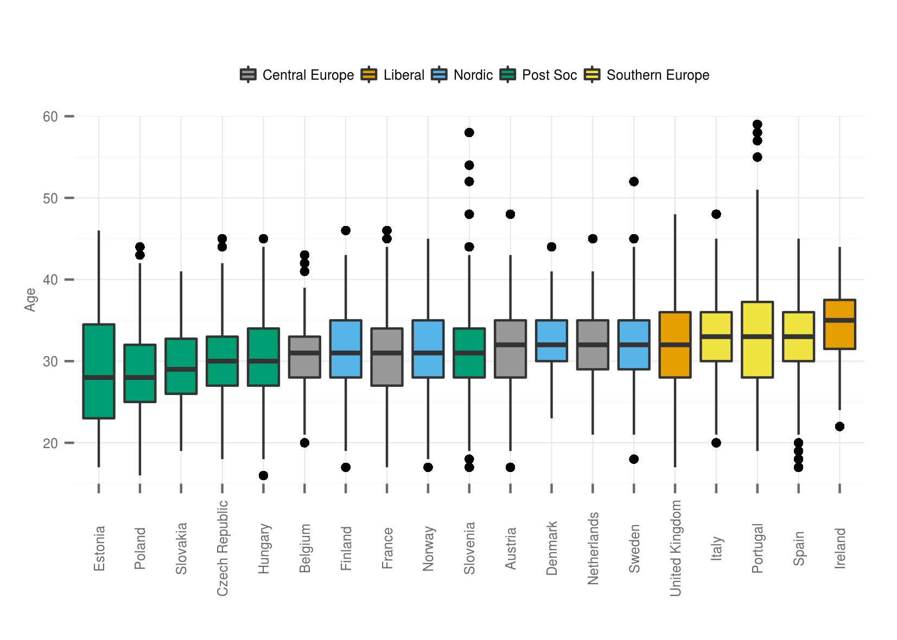
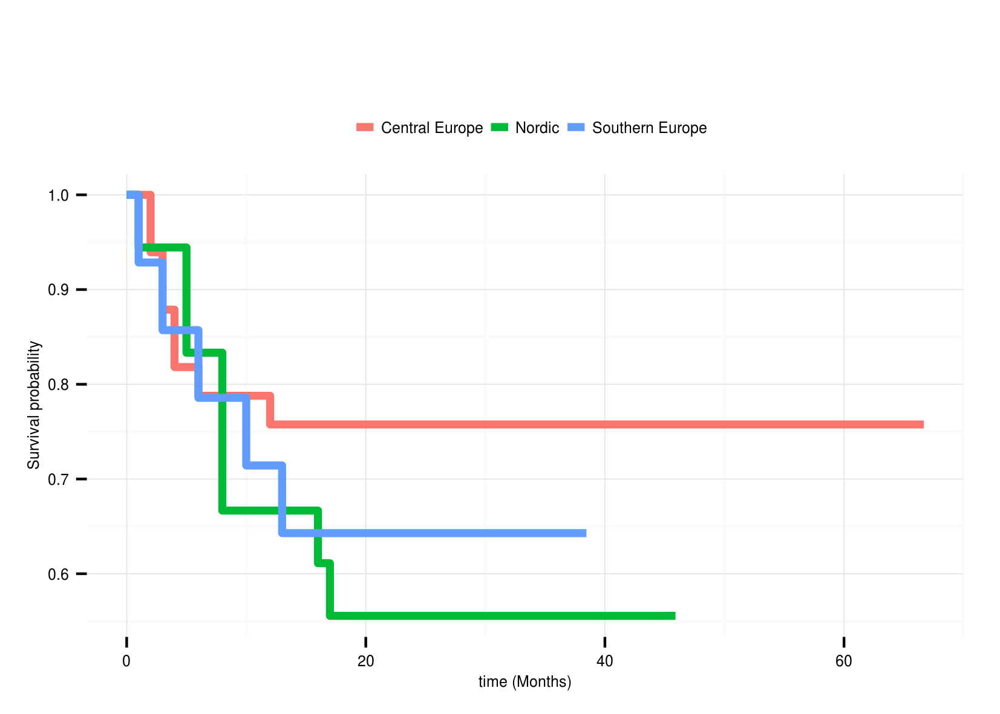

- [Back to index](index.html)

<h1 class="title">Figures for the paper</h1>

```{roptsmissing, echo=FALSE}
opts_chunk$set(echo=FALSE,eval=TRUE,fig.height=8,
               fig.width=10,cache=TRUE)
```

# Countries and regimes in the analysis

```{rmiscGrouping}
cntry <- c("Austria","Belgium","Germany","France","Netherlands","Switzerland","Denmark","Finland","Norway","Sweden","Australia","Canada","Ireland","New Zealand","United Kingdom","United States","Italy","Spain","Portugal","Greece","Czech Republic","Estonia","Slovenia","Slovakia","Hungary","Poland","Japan","Korea")
cntryDat <- data.frame(cntry)
cntryDat$regime[cntryDat$cntry %in% c("Austria","Belgium","Germany",
                                      "France","Netherlands",
                                      "Switzerland")] <- "Central Europe"
cntryDat$regime[cntryDat$cntry %in% c("Denmark","Finland",
                                      "Norway","Sweden")] <- "Nordic"
cntryDat$regime[cntryDat$cntry %in% c("Australia","Canada",
                                      "Ireland","New Zealand",
                                      "United Kingdom","United States")] <- "Liberal"
cntryDat$regime[cntryDat$cntry %in% c("Italy","Spain",
                                      "Portugal","Greece")] <- "Southern Europe"
cntryDat$regime[cntryDat$cntry %in% c("Czech Republic","Estonia","Slovenia",
                                      "Slovakia","Hungary","Poland")] <- "Post Soc"
cntryDat$regime[cntryDat$cntry %in% c("Japan","Korea")] <- "East Asia"
library(countrycode)
cntryDat$iso2c <- countrycode(cntryDat$cntry, "country.name",
                              "iso2c", 
                              warn = FALSE)
cntryDat$iso3c <- countrycode(cntryDat$cntry, "country.name",
                              "iso3c", 
                              warn = FALSE)
cntryDat$iso2c[cntryDat$iso2c == "GB"] <- "UK"
save(cntryDat, file="data/cntryDat.RData")

cbbPalette <- c("#999999", "#E69F00", "#56B4E9", "#009E73", "#F0E442", "#0072B2", "#D55E00", "#CC79A7")


```

```{rprintCntryData, results='asis'}
library(xtable)
print.xtable(xtable(cntryDat), type="html",
             include.rownames=FALSE)

```


# Old age dependency rations in Europe 2010 - 2050

*data source*: 
- [past](http://epp.eurostat.ec.europa.eu/tgm/table.do?tab=table&init=1&language=en&pcode=tsdde510&plugin=0)
- [projected](http://epp.eurostat.ec.europa.eu/tgm/table.do?tab=table&init=1&language=en&pcode=tsdde511&plugin=0)

```{roldAgeDependencyData}
library(SmarterPoland)
# Old age dependency 
rawOe <- getEurostatRCV(kod = "tsdde510")
rawOe$time <- as.numeric(levels(rawOe$time))[rawOe$time]
Oe <- rawOe[rawOe$time >= 1990,]
# Old age dependency projected
rawOeP <- getEurostatRCV(kod = "tsdde511")
rawOeP$time <- as.numeric(levels(rawOeP$time))[rawOeP$time]
OeP <- rawOeP[rawOeP$time >= 2015,]
OeP <- OeP[OeP$time <= 2050,]
datOe <- rbind(Oe,OeP)
datOe <- merge(datOe,cntryDat,by.x="geo",
               by.y="iso2c")
```

```{roldAgeDependencyPlot, results='hide'}
library(ggplot2)
plot <- ggplot(datOe, aes(x=time,y=value,color=regime,group=geo)) +
  geom_point(size=1.5) + geom_line(size=.5) + 
  annotate("segment", x = 2012, xend = 2012, y = 5, 
           yend = 65, colour = "dim Grey", linetype="dotted") +
  theme_minimal() +
  scale_color_manual(values = cbbPalette) + 
  annotate("text", x = 2020, y = 50, label = "Projected", size=2) +
  annotate("text", x = 2004, y = 50, label = "Observed", size=2) +
  labs(x="",y="Old age dependency ratio") +
  theme(legend.position="top") +
  geom_text(data=merge(datOe, aggregate(time ~ geo, datOe, max),
                            by=c("time","geo")),
                 aes(x=time,y=value,label=cntry),
                 hjust=-.1,size=2) +
  coord_cartesian(xlim=c(1990,2060)) +
  theme(legend.title=element_blank()) +
  theme(legend.text=element_text(size=6)) +
  theme(legend.position="top") +
  theme(axis.title = element_text(size=6, colour="dim grey")) +
  theme(axis.text = element_text(size=6, colour="dim grey")) +
  theme(axis.ticks = element_line(colour="dim grey")) +
  guides(color = guide_legend(nrow = 2)) +
  theme(legend.key.size = unit(3, "mm")) +
  scale_x_continuous(breaks = seq(1990, 2050, by=5))

ggsave(plot,file="figure/OaDependencyRatio.png",
       width=14/2.54, 
       height=12/2.54, 
       dpi=300)
```



- [For MS Word](figure/OaDependencyRatio.png)


# 15-29 year-olds who are neither in employment nor in education or training

*data source*:
- [Education at a Glance 2013: OECD Indicators](http://www.oecd.org/edu/eag.htm)
    - [Chapter C:  Access to education, participation and progression - Indicator C5: Transition from school to work: Where are the 15-29 year-olds?](http://dx.doi.org/10.1787/888932850870)


```{rYouthUnemploymentData}
#download.file(url="http://dx.doi.org/10.1787/888932850870", destfile="data/excel.xls")
## then manually save sheets 7 and 8 into .csv as eduMen and eduWomen
men <- read.csv("data/eduMen.csv", skip=12)
men <- men[1:46,]
menS <- men[1:34,c(1,11)]
names(menS) <- c("cntry","men")
#
women <- read.csv("data/eduWomen.csv", skip=12)
women <- women[1:46,]
womenS <- women[1:34,c(1,11)]
names(womenS) <- c("cntry","women")
neet <- merge(menS,womenS,by="cntry")
# into long format
library(reshape2)
neetL <-  melt(neet, id.vars = "cntry")
neetL$valueNum <- gsub(x=neetL$value, pattern=",",replacement=".")
# into numerical
neetL$valueNum <- factor(neetL$valueNum)
neetL$valueNum <- as.numeric(levels(neetL$valueNum))[neetL$valueNum]
neetL <- merge(neetL,cntryDat,by="cntry")
# reorder the country values for the plot by NEET average
order.data <- dcast(neetL, cntry + regime ~ variable, 
                    value.var="valueNum")
order.data$mean <- rowSums(order.data[,3:4])/2

order.data <- order.data[order(-order.data$mean), ]
neetL$cntry <- factor(neetL$cntry,
                      levels=order.data$cntry)
```


```{ryouthUnemploymentPlot, results='hide'}
library(ggplot2)
plot <- ggplot(neetL, aes(x=cntry,group=cntry)) +
    geom_path(data=neetL,aes(x=cntry,y=valueNum,
                             group=cntry,
                             color=regime),
              size=.8) +
  geom_point(data=neetL[neetL$variable %in% "men",], 
             aes(y=valueNum,shape=variable,color=regime),size=2.5) + 
  geom_point(data=neetL[neetL$variable %in% "women",], 
             aes(y=valueNum,shape=variable,color=regime),size=2.5) +
  theme_minimal() +
  scale_color_manual(values = cbbPalette) + 
  labs(x="",y="15-29 year-olds who are neither \n in employment nor in education or training") +
  theme(legend.title=element_blank()) +
  theme(legend.text=element_text(size=6)) +
  theme(legend.position="top") +
  theme(axis.title = element_text(size=6, colour="dim grey")) +
  theme(axis.text = element_text(size=6, colour="dim grey")) +
  theme(axis.ticks = element_line(colour="dim grey")) +
  guides(color = guide_legend(nrow = 2)) +
  theme(legend.key.size = unit(3, "mm")) +
  theme(axis.text.x = element_text(angle = 90, vjust = 0.5))

ggsave(plot,file="figure/NEETunEmployment.png",
       width=14/2.54, 
       height=12/2.54, 
       dpi=300)


```



- [For MS Word](figure/NEETunEmployment.png)


# Female labor force participation rates (%) according to age in different welfare state regimes 1980 and 2010

*data source*: from QoG data `plf_flf` - female labor force - OECD population and labor force statistics


```{rfemaleLaborData}
download.file("http://www.qogdata.pol.gu.se/data/qog_soc_tsl_4apr12.csv", destfile="data/qog_soc_tsl_4apr12.csv")
dat <- read.csv("data/qog_soc_tsl_4apr12.csv", sep = ";")
#
dat2 <- dat[c("cname","year","plf_flf")]
dat2 <- dat2[dat2$year >= 1980,]
dat2$cname <- as.character(dat2$cname)
dat2$cname[dat2$cname %in% "Korea, South"] <- "Korea"
dat2$cname <- factor(dat2$cname)
laborDat <- merge(dat2,cntryDat,by.x="cname",by.y="cntry")
laborDat <- laborDat[!is.na(laborDat$plf_flf), ]

```


```{rFemaleLaborForcePlot, results='hide'}
library(ggplot2)
plot <- ggplot(laborDat, aes(x=year,y=plf_flf,
                     group=cname,color=regime)) +
  geom_point(size=1.5) + geom_line(size=.5) + 
  theme_minimal() +
  labs(x="year",y="Female labor force participation rates (%)") +
  geom_text(data=merge(laborDat, 
                       aggregate(year ~ cname, laborDat, max),
                            by=c("year","cname")),
                 aes(x=year,y=plf_flf,label=cname),
                 hjust=-.1,size=2) +
  coord_cartesian(xlim=c(1980,2015)) +
  theme(legend.title=element_blank()) +
  theme(legend.text=element_text(size=6)) +
  theme(legend.position="none") +
  scale_color_manual(values = cbbPalette) + 
  theme(axis.title = element_text(size=6, colour="dim grey")) +
  theme(axis.text = element_text(size=6, colour="dim grey")) +
  theme(axis.ticks = element_line(colour="dim grey")) +
  theme(strip.text = element_text(size=6, colour="dim grey")) +
  guides(color = guide_legend(nrow = 2)) +
  theme(legend.key.size = unit(3, "mm")) +
  facet_wrap(~regime, ncol=2)  +
  theme(axis.text.x = element_text(angle = 90, vjust = 0.5))

ggsave(plot,file="figure/FemaleLaborForce.png",
       width=14/2.54, 
       height=16/2.54, 
       dpi=300)
```



- [For MS Word](figure/FemaleLaborForce.png)

# Gender wage gap

*data source*: [OECD - Gender wage gap](http://www.oecd.org/gender/data/genderwagegap.htm)


```{rGenderWageGap}
# download.file("http://www.oecd.org/gender/data/EMP8.xls",
#               destfile="data/genderwagegap.xls")
# saved the only sheet into genderwagegap.csv
dat <- read.csv("data/genderwagegap.csv", skip=3)
dat <- dat[1:39,1:12]
# into long format
library(reshape2)
datL <-  melt(dat, id.vars = "Country")
datL$value <- gsub(x=datL$value, pattern=",",replacement=".")
datL$variable <- gsub(x=datL$variable, pattern="X",replacement="")
datL$value[datL$value == ".."] <- NA
# into numerical
datL$value <- factor(datL$value)
datL$value <- as.numeric(levels(datL$value))[datL$value]
datL$variable <- factor(datL$variable)
datL$variable <- as.numeric(levels(datL$variable))[datL$variable]
datL <- merge(datL,cntryDat,by.x="Country",
              by.y="cntry")
datL <- datL[!is.na(datL$value), ]
```


```{rGenderWageGapPlot, results='hide'}
library(ggplot2)
plot <- ggplot(datL, aes(x=variable,y=value,
                     group=Country,color=regime)) +
  geom_point(size=1.5) + geom_line(size=.5) + 
  theme_minimal() +
  labs(x="",y="Gender wage gap (%)") +
  geom_text(data=merge(datL, 
                       aggregate(variable ~ Country, datL, max),
                            by=c("variable","Country")),
                 aes(x=variable,y=value,label=Country),
                 hjust=-.1,size=2) +
  coord_cartesian(xlim=c(2000,2013)) +
  theme(legend.title=element_blank()) +
  theme(legend.text=element_text(size=6)) +
  theme(legend.position="none") +
  scale_color_manual(values = cbbPalette) + 
  theme(axis.title = element_text(size=6, colour="dim grey")) +
  theme(axis.text = element_text(size=6, colour="dim grey")) +
  theme(axis.ticks = element_line(colour="dim grey")) +
  theme(strip.text = element_text(size=6, colour="dim grey")) + 
  guides(color = guide_legend(nrow = 2)) +
  theme(legend.key.size = unit(3, "mm")) +
  facet_wrap(~regime, ncol=2)  +
  theme(axis.text.x = element_text(angle = 90, vjust = 0.5)) + 
  scale_x_continuous(breaks = seq(2000, 2014, by=2))


ggsave(plot,file="figure/GenderPayGap.png",
       width=14/2.54, 
       height=16/2.54, 
       dpi=300)


```



- [For MS Word](figure/GenderPayGap.png)


# Distribution of age of women given birth

```{rsubsetentermaterintyhistogram}
load("data/datEnterBirth2.RData")

datTm <- datEnterBirth2[datEnterBirth2$year==datEnterBirth2$RB010,]

library(ggplot2)
library(grid)

datTm <- merge(datTm,cntryDat,by.x="RB020",by.y="iso2c")

plot <- ggplot(data=datTm, 
       aes(x=factor(reorder(cntry, RX010, median, na.rm=TRUE)),
           y=RX010,
           fill=regime)) + 
  geom_boxplot() +
  scale_fill_manual(values=cbbPalette) +
  theme_minimal() +
  theme(legend.position="top") +
  labs(x="",y="Age of mothers") +
  theme(legend.title=element_blank()) +
  theme(legend.text=element_text(size=6)) +
  theme(legend.position="top") +
  theme(axis.title = element_text(size=6, colour="dim grey")) +
  theme(axis.text = element_text(size=6, colour="dim grey")) +
  theme(axis.ticks = element_line(colour="dim grey")) +
  theme(legend.key.size = unit(3, "mm")) +
  theme(axis.text.x = element_text(angle = 90, vjust = 0.5))+
  coord_cartesian(ylim=c(15,60))
  
ggsave(plot,file="figure/MotherAge.png",
       width=14/2.54, 
       height=10/2.54, 
       dpi=300)
```




- [For MS Word](figure/MotherAge.png)

# Survival curves

```{rPlotsSurvivalcurves, results='hide'}
library(survival)
load("data/df.long4.RData")
load("data/cntryDat.RData")
#kmsurvival <- survfit(Surv(df.long3$duration,df.long3$event) ~ 1)
df.long4$cntry <- NULL
df.long4 <- merge(df.long4,cntryDat,by.x="RB020",
                   by.y="iso2c")

# lets remove liberal & post soc regimes
df.long5 <- df.long4[df.long4$regime %in% c("Central Europe","Nordic","Southern Europe"),]
reg <- survfit(Surv(df.long5$duration,df.long5$event) ~ df.long5$regime)

source("survival/ggsurvMod.R")
plot <- ggsurv(reg, plot.cens=FALSE)
plotCI <- ggsurv(reg, CI=TRUE, plot.cens=FALSE)

ggsave(plot,file="figure/KaplanMeier.png",
       width=14/2.54, 
       height=10/2.54, 
       dpi=300)

ggsave(plotCI,file="figure/KaplanMeierCI.png",
       width=14/2.54, 
       height=10/2.54, 
       dpi=300)

```

## With CI


[Load for Ms Word](figure/KaplanMeierCI.png)

## Without CI



[Load for Ms Word](figure/KaplanMeier.png)